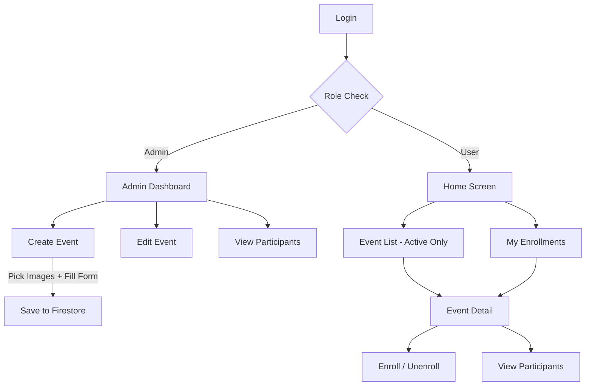

# Event Management System — Full Implementation Plan

Build a complete event management system where **Admin creates/manages events** and **Users browse, enroll, and view participants**.

---

## Constraints

> [!WARNING]
> **Firebase Free Tier (Spark Plan)** — No Firebase Storage available. Event images will be stored as **local device paths** in Firestore. This means:
> - Images picked by the admin are only visible on the **admin's device**
> - Other users will see **placeholder images based on event type** (conference, webinar, etc.)
> - When you upgrade to Blaze plan in the future, we can add Firebase Storage for cloud image uploads and all users will see the actual images

---

## Firestore Data Model

### `events` collection

```typescript
interface AppEvent {
  id: string;                // Firestore document ID (auto)
  title: string;             // Event name
  description: string;       // Full event details
  date: Timestamp;           // Start date & time
  endDate?: Timestamp;       // End date & time (optional, multi-day events)
  location: string;          // Venue name or "Virtual"
  type: EventType;           // 'conference' | 'webinar' | 'training' | 'meeting'
  images: string[];          // Local device paths (admin only) — fallback to type placeholder
  enrolledCount: number;     // Denormalized count (for quick display without query)
  maxCapacity?: number;      // Optional max enrollment limit
  createdBy: string;         // Admin UID (auto-filled)
  createdAt: Timestamp;      // Auto
  updatedAt: Timestamp;      // Auto
}
```

### `enrollments` collection (flat — for efficient querying)

```typescript
interface Enrollment {
  id: string;                // Firestore document ID (auto)
  eventId: string;           // Reference to event
  eventTitle: string;        // Denormalized for quick display
  eventDate: Timestamp;      // Denormalized for sorting
  uid: string;               // Enrolled user's UID
  displayName: string;       // Denormalized from UserProfile
  email: string;             // Denormalized from UserProfile
  profileImage?: string;     // Denormalized from UserProfile
  enrolledAt: Timestamp;     // When the user enrolled
}
```

> [!NOTE]
> **Why a flat `enrollments` collection instead of a subcollection?**
> A flat collection allows two efficient queries:
> - **Get event participants**: `where('eventId', '==', eventId)`
> - **Get user's enrolled events**: `where('uid', '==', uid)`
> Firestore subcollections cannot be queried across parents without collection group queries, which are harder to secure.

### Query Patterns

| Use Case | Query |
|---|---|
| All active events (user home) | `events` → `where('endDate', '>', now)` OR `where('date', '>', now)` ordered by `date` asc |
| All events (admin dashboard) | `events` → ordered by `createdAt` desc |
| Participants of an event | `enrollments` → `where('eventId', '==', eventId)` |
| User's enrolled events | `enrollments` → `where('uid', '==', uid)` |
| Check if user already enrolled | `enrollments` → `where('eventId', '==', eventId)` AND `where('uid', '==', uid)` |

---

## User Review Required

> [!IMPORTANT]
> **Image Approach**: On the free tier, images picked by admin are stored as local paths (only visible on admin's device). Other users see placeholder images based on event type. When you upgrade to Blaze plan later, we can switch to Firebase Storage for full image support. Is this approach acceptable?

> [!IMPORTANT]
> **Enrollment Limit**: Should events have a `maxCapacity` field to limit how many users can enroll? (e.g. max 100 participants for a training session)

> [!IMPORTANT]
> **Event Types**: Current types are `conference | webinar | training | meeting`. Want to add more?

---

## Proposed Changes

### 1. Service Layer

#### [NEW] [eventService.ts](file:///Users/apple/Desktop/Heet/ISOP_RN/src/services/eventService.ts)
Admin CRUD for events:
- `createEvent(data)` — Save event to Firestore with local image paths + auto timestamps
- `getEvents()` — Real-time listener (`onSnapshot`), all events ordered by date
- `getActiveEvents()` — Only events that haven't ended yet (for users)
- `getEventById(id)` — Single event fetch
- `updateEvent(id, data)` — Update event fields + refresh `updatedAt`
- `deleteEvent(id)` — Delete event document + all its enrollments

#### [NEW] [enrollmentService.ts](file:///Users/apple/Desktop/Heet/ISOP_RN/src/services/enrollmentService.ts)
User enrollment operations:
- `enrollInEvent(eventId, userProfile)` — Create enrollment + increment `enrolledCount`
- `unenrollFromEvent(enrollmentId, eventId)` — Remove enrollment + decrement `enrolledCount`
- `checkEnrollment(eventId, uid)` — Check if user is already enrolled (returns enrollment doc or null)
- `getEventParticipants(eventId)` — List all enrolled users for an event
- `getUserEnrollments(uid)` — List all events a user has enrolled in

---

### 2. Constants, Types & Helpers

#### [MODIFY] [collections.ts](file:///Users/apple/Desktop/Heet/ISOP_RN/src/constants/collections.ts)
- Add `EVENTS: 'events'` and `ENROLLMENTS: 'enrollments'`

#### [MODIFY] [types/index.ts](file:///Users/apple/Desktop/Heet/ISOP_RN/src/types/index.ts)
- Update `AppEvent` interface with `images`, `enrolledCount`, `maxCapacity`
- Add new `Enrollment` interface

#### [NEW] [eventHelpers.ts](file:///Users/apple/Desktop/Heet/ISOP_RN/src/utils/eventHelpers.ts)
- `getEventImage(event)` — Returns first local image if available, otherwise placeholder based on event type
- `getEventPlaceholder(type)` — Map event type to bundled placeholder image
- `formatEventDate(timestamp)` — Format to readable date string
- `formatEventDateRange(start, end)` — "Apr 15 — Apr 17, 2026"
- `getEventTypeLabel(type)` — `conference` → `Conference`
- `getEventTypeColor(type)` — Return a unique badge color per type
- `isEventActive(event)` — Check if event hasn't ended
- `isEventFull(event)` — Check if `enrolledCount >= maxCapacity`

#### [NEW] Static placeholder images in `src/assets/images/`
- `event_conference.png`
- `event_webinar.png`
- `event_training.png`
- `event_meeting.png`
- `event_default.png`

> These will be generated using the image generation tool to ensure professional, branded visuals.

---

### 3. Reusable Components

#### [NEW] [EventCard.tsx](file:///Users/apple/Desktop/Heet/ISOP_RN/src/components/EventCard.tsx)
- Card showing: image (local or placeholder), title, date, location, type badge, enrolled count
- Props: `onPress`, `onEdit?`, `onDelete?` (admin actions optional)
- Used in Admin Dashboard, User Event List, and My Enrollments

#### [NEW] [EventTypePicker.tsx](file:///Users/apple/Desktop/Heet/ISOP_RN/src/components/EventTypePicker.tsx)
- Horizontal chip selector for event types
- Selected state highlight
- Used in Create/Edit Event forms

#### [NEW] [ImagePickerGrid.tsx](file:///Users/apple/Desktop/Heet/ISOP_RN/src/components/ImagePickerGrid.tsx)
- Grid display of selected images (local paths)
- "Add Image" button (uses `react-native-image-crop-picker` with `multiple: true`)
- Remove button (X) on each image thumbnail
- Used in Create/Edit Event forms

#### [NEW] [ParticipantCard.tsx](file:///Users/apple/Desktop/Heet/ISOP_RN/src/components/ParticipantCard.tsx)
- Row showing: user avatar (or initials fallback), name, email
- Used in the Participants list screen

---

### 4. Admin Screens

#### [MODIFY] [AdminDashboard.tsx](file:///Users/apple/Desktop/Heet/ISOP_RN/src/screens/admin/AdminDashboard.tsx)
Transform from placeholder to functional:
- Header with "Admin Panel" title
- Stats cards (total events, total enrollments)
- "Create New Event" prominent button
- `FlatList` of all events using `EventCard` with Edit/Delete actions
- Empty state illustration when no events exist

#### [NEW] [CreateEventScreen.tsx](file:///Users/apple/Desktop/Heet/ISOP_RN/src/screens/admin/CreateEventScreen.tsx)
- Title input
- Description input (multiline)
- Start date picker (`react-native-date-picker` — already installed)
- End date picker (optional toggle)
- Location input
- Event type selector (`EventTypePicker`)
- Multi-image picker (`ImagePickerGrid`) — stores local paths
- Max capacity input (optional number)
- "Create Event" button → saves to Firestore
- Validation + `CustomLoader` + Toast

#### [NEW] [EditEventScreen.tsx](file:///Users/apple/Desktop/Heet/ISOP_RN/src/screens/admin/EditEventScreen.tsx)
- Pre-populated form from navigation params (`eventId`)
- Manage existing images (remove) + add new ones
- "Save Changes" button
- "Delete Event" button with `Alert.alert` confirmation
- Toast on success/failure

#### [NEW] [EventParticipantsScreen.tsx](file:///Users/apple/Desktop/Heet/ISOP_RN/src/screens/admin/EventParticipantsScreen.tsx)
- Receives `eventId` via navigation params
- Header with event title and total participant count
- `FlatList` of enrolled users using `ParticipantCard`
- Empty state when no enrollments

---

### 5. User Screens

#### [MODIFY] [HomeScreen.tsx](file:///Users/apple/Desktop/Heet/ISOP_RN/src/screens/home/HomeScreen.tsx)
Transform from placeholder to functional:
- Welcome header: "Hello, {displayName}"
- "Upcoming Events" section — next 3 active events using `EventCard`
- "View All Events" button → navigates to `EventListScreen`
- "My Enrollments" button → navigates to `MyEventsScreen`
- If admin → "Admin Dashboard" button

#### [NEW] [EventListScreen.tsx](file:///Users/apple/Desktop/Heet/ISOP_RN/src/screens/events/EventListScreen.tsx)
- `FlatList` of all **active** (not ended) events
- Pull-to-refresh
- Each card taps to `EventDetailScreen`
- Empty state if no upcoming events

#### [NEW] [EventDetailScreen.tsx](file:///Users/apple/Desktop/Heet/ISOP_RN/src/screens/events/EventDetailScreen.tsx)
- Image area at top (placeholder based on event type for users)
- Event title, description, date range, location, type badge
- Enrolled count display (e.g. "42 participants")
- **"Enroll Now" button** (if not enrolled) / **"Unenroll" button** (if already enrolled)
- Disabled enroll if event is full (`maxCapacity` reached)
- "View Participants" button → navigates to participant list
- `CustomLoader` during enrollment/unenrollment

#### [NEW] [MyEventsScreen.tsx](file:///Users/apple/Desktop/Heet/ISOP_RN/src/screens/events/MyEventsScreen.tsx)
- `FlatList` of events the current user has enrolled in
- Uses `EventCard` — tapping navigates to `EventDetailScreen`
- Empty state if no enrollments

#### [NEW] [EventParticipantsScreen.tsx](file:///Users/apple/Desktop/Heet/ISOP_RN/src/screens/events/EventParticipantsScreen.tsx)
- Receives `eventId` via navigation params
- `FlatList` of enrolled users using `ParticipantCard`
- Accessible to both admin and enrolled users

---

### 6. Navigation Updates

#### [MODIFY] [AdminStack.tsx](file:///Users/apple/Desktop/Heet/ISOP_RN/src/navigation/AdminStack.tsx)
Add screens:
- `AdminDashboard` (initial)
- `CreateEvent`
- `EditEvent` (param: `eventId`)
- `EventParticipants` (param: `eventId`)

#### [MODIFY] [UserStack.tsx](file:///Users/apple/Desktop/Heet/ISOP_RN/src/navigation/UserStack.tsx)
Add screens:
- `Home` (initial)
- `EventList`
- `EventDetail` (param: `eventId`)
- `MyEvents`
- `EventParticipants` (param: `eventId`)

---

## Complete App Flow



---

## Build Order

| Step | What | Files |
|---|---|---|
| 1 | Types + Collections | `types/index.ts`, `collections.ts` |
| 2 | Event service | `eventService.ts` |
| 3 | Enrollment service | `enrollmentService.ts` |
| 4 | Helper utilities + placeholder images | `eventHelpers.ts`, `assets/images/*` |
| 5 | Reusable components | `EventCard`, `EventTypePicker`, `ImagePickerGrid`, `ParticipantCard` |
| 6 | Admin screens | `AdminDashboard`, `CreateEvent`, `EditEvent`, `EventParticipants` |
| 7 | User screens | `HomeScreen`, `EventList`, `EventDetail`, `MyEvents`, `EventParticipants` |
| 8 | Navigation wiring | `AdminStack.tsx`, `UserStack.tsx` |
| 9 | Firestore indexes (if needed for compound queries) | Firebase Console |

> [!TIP]
> **Future Upgrade Path**: When you switch to Blaze plan, we add `@react-native-firebase/storage` + `storageService.ts`, update `eventService` to upload images, and replace local paths with download URLs. The rest of the app stays the same.

---

## Verification Plan

### Manual Verification
1. **Admin Creates Event** — Pick multiple images + fill form → event saved to Firestore with local paths
2. **Admin Edits Event** — Modify fields, add/remove images → changes reflect immediately
3. **Admin Deletes Event** — Confirmation → event + all enrollments removed
4. **User Sees Active Events** — Only events with future dates appear, with placeholder images
5. **User Enrolls** — Tap "Enroll Now" → enrollment created, count increments, button changes to "Unenroll"
6. **User Unenrolls** — Tap "Unenroll" → enrollment removed, count decrements
7. **View Participants** — Both admin and enrolled users can see the list
8. **My Events** — User sees only their enrolled events
9. **Full Capacity** — If `enrolledCount >= maxCapacity`, "Enroll Now" button is disabled
