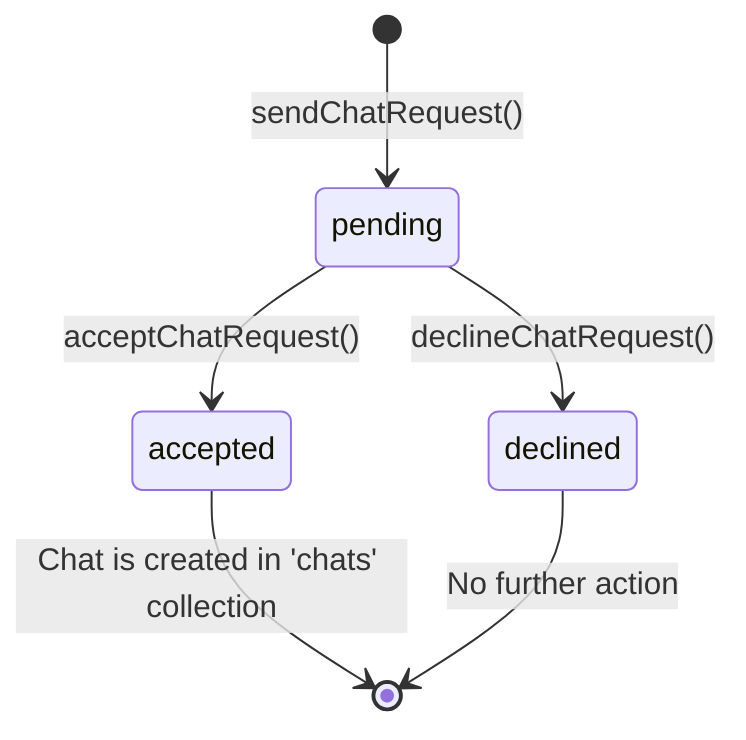
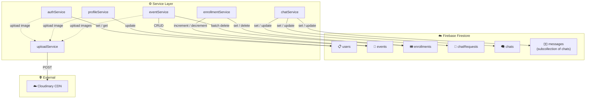

# 🗂️ ISoP — Firestore Collections & Services Guide

> A complete reference for every Firestore collection used in the **ISOP_RN** React Native app, the TypeScript types that model them, and the service functions that read/write to them.

---

## Table of Contents

1. [Overview](#overview)
2. [Collections at a Glance](#collections-at-a-glance)
3. [Collection Details](#collection-details)
   - [1. `users`](#1-users)
   - [2. `events`](#2-events)
   - [3. `enrollments`](#3-enrollments)
   - [4. `chatRequests`](#4-chatrequests)
   - [5. `chats`](#5-chats)
   - [6. `messages`](#6-messages-subcollection)
4. [Service File Summary](#service-file-summary)
5. [Data Flow Diagram](#data-flow-diagram)
6. [Key Patterns Used](#key-patterns-used)

---

## Overview

All collection names are centrally defined in a single constants file:

```typescript
// src/constants/collections.ts
export const COLLECTIONS = {
  USERS: 'users',
  EVENTS: 'events',
  ENROLLMENTS: 'enrollments',
  CHAT_REQUESTS: 'chatRequests',
  CHATS: 'chats',
  MESSAGES: 'messages',
} as const;

export type CollectionName = (typeof COLLECTIONS)[keyof typeof COLLECTIONS];
```

Every service file imports `COLLECTIONS` and uses these string constants instead of raw strings — this prevents typos and makes renaming a collection a one-line change.

---

## Collections at a Glance

| # | Collection Name | Firestore Path | TypeScript Interface | Primary Service File | Purpose |
|---|----------------|----------------|---------------------|---------------------|---------|
| 1 | `users` | `/users/{uid}` | `UserProfile` | `authService.ts`, `profileService.ts` | Stores user profile data |
| 2 | `events` | `/events/{eventId}` | `AppEvent` | `eventService.ts` | Stores event information |
| 3 | `enrollments` | `/enrollments/{enrollmentId}` | `Enrollment` | `enrollmentService.ts` | Tracks which users joined which events |
| 4 | `chatRequests` | `/chatRequests/{requestId}` | `ChatRequest` | `chatService.ts` | Manages chat connection requests between users |
| 5 | `chats` | `/chats/{chatId}` | `Chat` | `chatService.ts` | Stores active chat conversations |
| 6 | `messages` | `/chats/{chatId}/messages/{messageId}` | `Message` | `chatService.ts` | **Subcollection** — stores individual chat messages |

---

## Collection Details

---

### 1. `users`

> **Firestore Path:** `/users/{uid}`
> **Document ID:** The Firebase Auth `uid` of the user

#### TypeScript Interface

```typescript
export type UserRole = 'admin' | 'user';

export interface UserProfile {
  uid: string;            // Firebase Auth UID (same as document ID)
  email: string;          // User's email address
  displayName: string;    // Full name of the user
  role: UserRole;         // Either 'admin' or 'user'
  phoneNumber?: string;   // Optional, stored as "{countryCode}{mobile}"
  profileImage?: string | null;  // Cloudinary URL or null
  createdAt: any;         // Firestore Timestamp — when account was created
  updatedAt: any;         // Firestore Timestamp — last profile update
}
```

#### How Services Use This Collection

##### ✍️ Writes

| Service File | Function | Operation | What It Does |
|---|---|---|---|
| [authService.ts](file:///Users/apple/Desktop/Heet/ISOP_RN/src/services/authService.ts) | `registerUser()` | `.set()` | Creates a new user document after Firebase Auth sign-up. Uploads profile image to Cloudinary first if provided. |
| [profileService.ts](file:///Users/apple/Desktop/Heet/ISOP_RN/src/services/profileService.ts) | `updateUserProfile()` | `.update()` | Updates any user profile fields (name, phone, image, etc.). Uploads a new profile image to Cloudinary if the image is a local file path. |

##### 📖 Reads

| Service File | Function | Operation | What It Does |
|---|---|---|---|
| [authService.ts](file:///Users/apple/Desktop/Heet/ISOP_RN/src/services/authService.ts) | `loginUser()` | `.get()` | Fetches the user profile document after successful login to populate the app state. |

##### 🔑 Key Behavior
- The document ID is always the user's **Firebase Auth UID** — this makes reads instant (no query needed, just `.doc(uid).get()`).
- `checkIsAdmin()` compares the UID against a hardcoded `ADMIN_UID` constant from config, NOT from a Firestore field. The role field in Firestore mirrors this for display purposes.

---

### 2. `events`

> **Firestore Path:** `/events/{eventId}`
> **Document ID:** Auto-generated by Firestore (`.doc()`)

#### TypeScript Interface

```typescript
export type EventType = 'conference' | 'webinar' | 'training' | 'meeting';

export interface AppEvent {
  id: string;              // Auto-generated document ID
  title: string;           // Event title
  description: string;     // Event description
  date: any;               // Firestore Timestamp — event start date
  endDate?: any;           // Firestore Timestamp — optional event end date
  location: string;        // Event location/venue
  type: EventType;         // One of 4 event types
  images: string[];        // Array of Cloudinary image URLs
  enrolledCount: number;   // Live count of enrolled participants
  maxCapacity?: number;    // Optional maximum number of participants
  createdBy: string;       // Admin UID who created the event
  createdAt: any;          // Firestore Timestamp
  updatedAt: any;          // Firestore Timestamp
}
```

#### How Services Use This Collection

##### ✍️ Writes

| Service File | Function | Operation | What It Does |
|---|---|---|---|
| [eventService.ts](file:///Users/apple/Desktop/Heet/ISOP_RN/src/services/eventService.ts) | `createEvent()` | `.set()` | Creates a new event. Uploads any local images to Cloudinary first, then sets `enrolledCount: 0`. |
| [eventService.ts](file:///Users/apple/Desktop/Heet/ISOP_RN/src/services/eventService.ts) | `updateEvent()` | `.update()` | Updates event fields. If `images` array contains local paths, uploads them to Cloudinary first. Always stamps `updatedAt`. |
| [eventService.ts](file:///Users/apple/Desktop/Heet/ISOP_RN/src/services/eventService.ts) | `deleteEvent()` | `.delete()` | Deletes the event document AND batch-deletes all related enrollment documents. |
| [enrollmentService.ts](file:///Users/apple/Desktop/Heet/ISOP_RN/src/services/enrollmentService.ts) | `enrollInEvent()` | `.update()` (batch) | Increments `enrolledCount` by 1 via `FieldValue.increment(1)`. |
| [enrollmentService.ts](file:///Users/apple/Desktop/Heet/ISOP_RN/src/services/enrollmentService.ts) | `unenrollFromEvent()` | `.update()` (batch) | Decrements `enrolledCount` by 1 via `FieldValue.increment(-1)`. |

##### 📖 Reads

| Service File | Function | Type | What It Does |
|---|---|---|---|
| [eventService.ts](file:///Users/apple/Desktop/Heet/ISOP_RN/src/services/eventService.ts) | `getEvents()` | 🔴 Real-time | Listens to ALL events ordered by `createdAt desc`. Used by **Admin Dashboard**. |
| [eventService.ts](file:///Users/apple/Desktop/Heet/ISOP_RN/src/services/eventService.ts) | `getActiveEvents()` | 🔴 Real-time | Listens to all events ordered by `date asc`, then client-side filters out events whose `endDate` (or `date`) has passed. Used by **User Home**. |
| [eventService.ts](file:///Users/apple/Desktop/Heet/ISOP_RN/src/services/eventService.ts) | `listenToEvent()` | 🔴 Real-time | Listens to a single event document by ID. Used for **Event Detail** screens to get live updates. |
| [eventService.ts](file:///Users/apple/Desktop/Heet/ISOP_RN/src/services/eventService.ts) | `getEventById()` | ⚪ One-time | Fetches a single event once (no listener). Used for static checks. |

##### 🔑 Key Behavior
- `enrolledCount` is managed atomically via `FieldValue.increment()` in batched writes — this prevents race conditions when multiple users enroll/unenroll simultaneously.
- `deleteEvent()` performs a **cascading delete** — it also deletes all enrollment documents that reference the event.

---

### 3. `enrollments`

> **Firestore Path:** `/enrollments/{enrollmentId}`
> **Document ID:** Auto-generated by Firestore (`.doc()`)

#### TypeScript Interface

```typescript
export interface Enrollment {
  id: string;              // Auto-generated document ID
  eventId: string;         // References → events/{eventId}
  eventTitle: string;      // Denormalized event title
  eventDate: any;          // Denormalized event date
  uid: string;             // References → users/{uid}
  displayName: string;     // Denormalized from user profile
  email: string;           // Denormalized from user profile
  profileImage?: string | null;  // Denormalized from user profile
  enrolledAt: any;         // Firestore Timestamp
}
```

> [!IMPORTANT]
> This collection uses **denormalization** — it copies fields like `displayName`, `email`, and `eventTitle` directly into the enrollment document. This avoids extra reads when displaying participant lists, but means those fields won't auto-update if the source changes.

#### How Services Use This Collection

##### ✍️ Writes

| Service File | Function | Operation | What It Does |
|---|---|---|---|
| [enrollmentService.ts](file:///Users/apple/Desktop/Heet/ISOP_RN/src/services/enrollmentService.ts) | `enrollInEvent()` | `.set()` (batch) | Creates an enrollment document AND increments `events/{eventId}.enrolledCount` — both in a single atomic batch. |
| [enrollmentService.ts](file:///Users/apple/Desktop/Heet/ISOP_RN/src/services/enrollmentService.ts) | `unenrollFromEvent()` | `.delete()` (batch) | Deletes the enrollment document AND decrements the event's `enrolledCount` — both in a single atomic batch. |
| [eventService.ts](file:///Users/apple/Desktop/Heet/ISOP_RN/src/services/eventService.ts) | `deleteEvent()` | `.delete()` (batch) | When an event is deleted, all enrollment documents with matching `eventId` are also batch-deleted. |

##### 📖 Reads

| Service File | Function | Type | What It Does |
|---|---|---|---|
| [enrollmentService.ts](file:///Users/apple/Desktop/Heet/ISOP_RN/src/services/enrollmentService.ts) | `checkEnrollment()` | ⚪ One-time | Queries by `eventId` + `uid` (limit 1) to check if a user is already enrolled. Returns the `Enrollment` or `null`. |
| [enrollmentService.ts](file:///Users/apple/Desktop/Heet/ISOP_RN/src/services/enrollmentService.ts) | `getEventParticipants()` | 🔴 Real-time | Listens to all enrollments for a given `eventId`, ordered by `enrolledAt desc`. Powers the **Participants List** on event detail screens. |
| [enrollmentService.ts](file:///Users/apple/Desktop/Heet/ISOP_RN/src/services/enrollmentService.ts) | `getUserEnrollments()` | 🔴 Real-time | Listens to all enrollments for a given `uid`, ordered by `eventDate asc`. Powers the **My Events** screen for users. |

##### 🔑 Key Behavior
- Enrollment and unenrollment are always done in **batched writes** that simultaneously update both the enrollment document and the event's `enrolledCount`. This guarantees data consistency.
- The `getEventParticipants()` listener is also used by the chat system to display the list of people a user can send chat requests to.

---

### 4. `chatRequests`

> **Firestore Path:** `/chatRequests/{requestId}`
> **Document ID:** Auto-generated by Firestore (`.doc()`)

#### TypeScript Interface

```typescript
export type ChatRequestStatus = 'pending' | 'accepted' | 'declined';

export interface ChatRequest {
  id: string;              // Auto-generated document ID
  fromUid: string;         // Sender's UID → references users/{uid}
  fromName: string;        // Denormalized sender name
  fromImage?: string | null;  // Denormalized sender profile image
  toUid: string;           // Recipient's UID → references users/{uid}
  toName: string;          // Denormalized recipient name
  eventId: string;         // The event context → references events/{eventId}
  eventTitle: string;      // Denormalized event title
  status: ChatRequestStatus;  // 'pending' → 'accepted' or 'declined'
  createdAt: any;          // Firestore Timestamp
  updatedAt: any;          // Firestore Timestamp
}
```

#### Status Lifecycle



#### How Services Use This Collection

##### ✍️ Writes

| Service File | Function | Operation | What It Does |
|---|---|---|---|
| [chatService.ts](file:///Users/apple/Desktop/Heet/ISOP_RN/src/services/chatService.ts) | `sendChatRequest()` | `.set()` | Creates a new chat request with `status: 'pending'`. First checks if any request already exists between the two users. |
| [chatService.ts](file:///Users/apple/Desktop/Heet/ISOP_RN/src/services/chatService.ts) | `acceptChatRequest()` | `.update()` (batch) | Updates the request to `status: 'accepted'` AND creates a new `Chat` document in the `chats` collection — both in a single batch. |
| [chatService.ts](file:///Users/apple/Desktop/Heet/ISOP_RN/src/services/chatService.ts) | `declineChatRequest()` | `.update()` | Updates the request to `status: 'declined'`. |

##### 📖 Reads

| Service File | Function | Type | What It Does |
|---|---|---|---|
| [chatService.ts](file:///Users/apple/Desktop/Heet/ISOP_RN/src/services/chatService.ts) | `getIncomingRequests()` | 🔴 Real-time | Listens for `pending` requests where `toUid == uid`. Shows incoming requests to the user. |
| [chatService.ts](file:///Users/apple/Desktop/Heet/ISOP_RN/src/services/chatService.ts) | `getSentRequests()` | 🔴 Real-time | Listens for `pending` requests where `fromUid == uid`. Shows sent requests to the user. |
| [chatService.ts](file:///Users/apple/Desktop/Heet/ISOP_RN/src/services/chatService.ts) | `getChatRequestStatus()` | ⚪ One-time | Checks if ANY request exists between two users (in either direction). Used to prevent duplicate requests. |
| [chatService.ts](file:///Users/apple/Desktop/Heet/ISOP_RN/src/services/chatService.ts) | `getAcceptedRequests()` | 🔴 Real-time | Listens to all `accepted` requests where the user is either `fromUid` or `toUid`. Uses **two separate listeners** merged client-side (Firestore doesn't support OR queries on different fields). |

##### 🔑 Key Behavior
- `getChatRequestStatus()` performs **two separate queries** to check both directions (A→B and B→A) since Firestore doesn't support OR across different fields.
- `getAcceptedRequests()` also merges two listeners and deduplicates by `id` using a `Map`.
- When a request is **accepted**, the `acceptChatRequest()` function atomically creates the corresponding `Chat` document using the same request ID as the chat ID.

---

### 5. `chats`

> **Firestore Path:** `/chats/{chatId}`
> **Document ID:** Same as the `chatRequest.id` that created it

#### TypeScript Interface

```typescript
export interface Chat {
  id: string;                  // Same as the ChatRequest ID
  participants: string[];      // Array of 2 UIDs
  participantNames: Record<string, string>;         // { uid1: "Name1", uid2: "Name2" }
  participantImages: Record<string, string | null>;  // { uid1: "url", uid2: null }
  lastMessage?: string;        // Text of the most recent message
  lastMessageAt?: any;         // Firestore Timestamp of last message
  createdAt: any;              // Firestore Timestamp
}
```

#### How Services Use This Collection

##### ✍️ Writes

| Service File | Function | Operation | What It Does |
|---|---|---|---|
| [chatService.ts](file:///Users/apple/Desktop/Heet/ISOP_RN/src/services/chatService.ts) | `acceptChatRequest()` | `.set()` (batch) | Creates the chat document when a chat request is accepted. |
| [chatService.ts](file:///Users/apple/Desktop/Heet/ISOP_RN/src/services/chatService.ts) | `sendMessage()` | `.update()` (batch) | Updates `lastMessage` and `lastMessageAt` on the chat document whenever a new message is sent. |

##### 📖 Reads

| Service File | Function | Type | What It Does |
|---|---|---|---|
| [chatService.ts](file:///Users/apple/Desktop/Heet/ISOP_RN/src/services/chatService.ts) | `getMyChats()` | 🔴 Real-time | Listens to all chats where `participants` array-contains the user's UID, ordered by `lastMessageAt desc`. Powers the **Chat List** screen. |

##### 🔑 Key Behavior
- The `participants` field is an **array** — this allows Firestore's `array-contains` query to efficiently find all chats a user is part of.
- `lastMessage` and `lastMessageAt` are **denormalized** from the messages subcollection to enable chat list sorting and preview without reading subcollection data.

---

### 6. `messages` (Subcollection)

> **Firestore Path:** `/chats/{chatId}/messages/{messageId}`
> **Document ID:** Auto-generated by Firestore (`.doc()`)

> [!NOTE]
> This is the **only subcollection** in the entire app. It lives inside each `chats/{chatId}` document rather than being a top-level collection.

#### TypeScript Interface

```typescript
export interface Message {
  id: string;          // Auto-generated document ID
  senderId: string;    // UID of the message sender
  text: string;        // Message text content
  createdAt: any;      // Firestore Timestamp
  read: boolean;       // Whether the recipient has read this message
}
```

#### How Services Use This Collection

##### ✍️ Writes

| Service File | Function | Operation | What It Does |
|---|---|---|---|
| [chatService.ts](file:///Users/apple/Desktop/Heet/ISOP_RN/src/services/chatService.ts) | `sendMessage()` | `.set()` (batch) | Creates a new message with `read: false` AND updates the parent chat's `lastMessage`/`lastMessageAt` — both in a single batch. |
| [chatService.ts](file:///Users/apple/Desktop/Heet/ISOP_RN/src/services/chatService.ts) | `markMessagesRead()` | `.update()` (batch) | Finds all unread messages NOT sent by the current user and batch-updates them to `read: true`. |

##### 📖 Reads

| Service File | Function | Type | What It Does |
|---|---|---|---|
| [chatService.ts](file:///Users/apple/Desktop/Heet/ISOP_RN/src/services/chatService.ts) | `getMessages()` | 🔴 Real-time | Listens to all messages in a chat, ordered by `createdAt desc` (newest first for inverted FlatList rendering). |
| [chatService.ts](file:///Users/apple/Desktop/Heet/ISOP_RN/src/services/chatService.ts) | `markMessagesRead()` | ⚪ One-time (query) | Queries unread messages sent by others (`senderId != uid`, `read == false`) before updating them. |

---

## Service File Summary

This section gives a quick overview of what each service file does and which collections it touches.

### [authService.ts](file:///Users/apple/Desktop/Heet/ISOP_RN/src/services/authService.ts)
| Collections Used | `users` |
|---|---|
| **Purpose** | Handles user registration, login, and logout |
| **Functions** | `checkIsAdmin()`, `registerUser()`, `loginUser()`, `logoutUser()` |
| **External Deps** | `uploadService.ts` (for profile image upload during registration) |

---

### [profileService.ts](file:///Users/apple/Desktop/Heet/ISOP_RN/src/services/profileService.ts)
| Collections Used | `users` |
|---|---|
| **Purpose** | Updates user profile fields |
| **Functions** | `updateUserProfile()` |
| **External Deps** | `uploadService.ts` (for profile image upload) |

---

### [eventService.ts](file:///Users/apple/Desktop/Heet/ISOP_RN/src/services/eventService.ts)
| Collections Used | `events`, `enrollments` |
|---|---|
| **Purpose** | Full CRUD for events + cascading enrollment cleanup |
| **Functions** | `createEvent()`, `getEvents()`, `getActiveEvents()`, `listenToEvent()`, `getEventById()`, `updateEvent()`, `deleteEvent()` |
| **External Deps** | `uploadService.ts` (for event image uploads) |

---

### [enrollmentService.ts](file:///Users/apple/Desktop/Heet/ISOP_RN/src/services/enrollmentService.ts)
| Collections Used | `enrollments`, `events` |
|---|---|
| **Purpose** | Manages user enrollment/unenrollment in events |
| **Functions** | `enrollInEvent()`, `unenrollFromEvent()`, `checkEnrollment()`, `getEventParticipants()`, `getUserEnrollments()` |

---

### [chatService.ts](file:///Users/apple/Desktop/Heet/ISOP_RN/src/services/chatService.ts)
| Collections Used | `chatRequests`, `chats`, `messages` |
|---|---|
| **Purpose** | Full chat lifecycle — requests, conversations, messaging |
| **Functions** | `sendChatRequest()`, `getIncomingRequests()`, `getSentRequests()`, `getChatRequestStatus()`, `acceptChatRequest()`, `declineChatRequest()`, `getAcceptedRequests()`, `getMyChats()`, `sendMessage()`, `getMessages()`, `markMessagesRead()` |

---

### [uploadService.ts](file:///Users/apple/Desktop/Heet/ISOP_RN/src/services/uploadService.ts)
| Collections Used | **None** (Cloudinary only) |
|---|---|
| **Purpose** | Uploads local images to Cloudinary and returns the public URL |
| **Functions** | `uploadImageToCloudinary()` |
| **Used By** | `authService.ts`, `profileService.ts`, `eventService.ts` |

> [!NOTE]
> `uploadService.ts` does NOT interact with Firestore at all. It purely handles Cloudinary uploads and is used as a helper by other services.

---

## Data Flow Diagram



---

## Key Patterns Used

### 1. Centralized Collection Names
All collection string constants live in `src/constants/collections.ts`. No service file uses a raw string for a collection name.

### 2. Batched Writes for Consistency
Operations that modify multiple documents (e.g., enrolling = create enrollment + increment count) always use `firebaseFirestore.batch()` to ensure atomicity.

### 3. Denormalization
User and event data is **copied** into enrollment and chat request documents. This trades storage for faster reads — displaying a participant list never requires a secondary query to the `users` collection.

### 4. Real-time Listeners (🔴) vs One-time Fetches (⚪)
- **Real-time (`onSnapshot`)** — used wherever the UI needs live updates (event lists, chat messages, participant lists).
- **One-time (`.get()`)** — used for validation checks (e.g., "is this user already enrolled?").

### 5. Image Upload Before Write
All services that store images follow the same pattern:
1. Check if image path is a local file (doesn't start with `http`)
2. Upload to Cloudinary via `uploadService`
3. Store the returned Cloudinary URL in Firestore

### 6. Soft Deletion of Chat Requests
Declined chat requests are **not deleted** — they're updated to `status: 'declined'`. This prevents users from spamming repeated requests, since `getChatRequestStatus()` checks for the existence of any request regardless of status.
