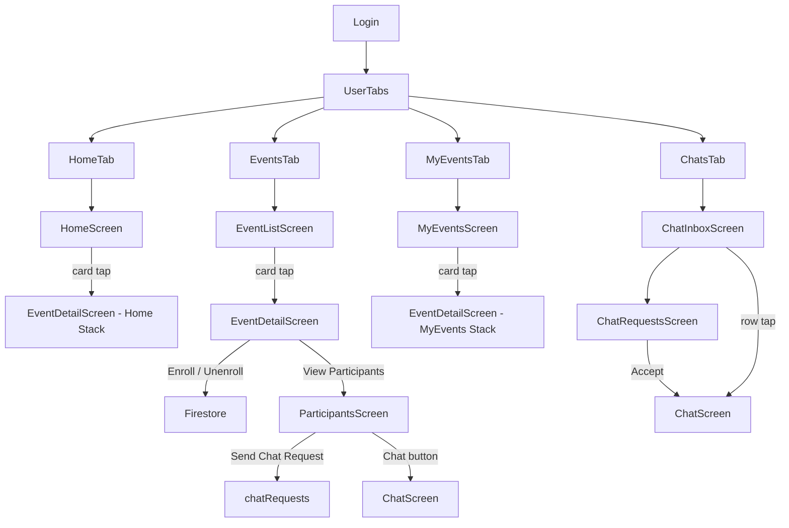

# User-Side Feature Implementation Plan

## Overview

This plan covers the complete user-facing experience for ISoP after login. The admin side is already complete. We now build:

1. **Bottom Tab Navigation** for users (Home, Events, My Events, Profile)
2. **Event List** — All upcoming events
3. **Event Detail** — Full details + Enroll / Unenroll
4. **Participants List** — Other enrolled users for an event
5. **Chat Request Flow** — Send/Accept/Decline chat requests to other participants
6. **Chat Screen** — Real-time 1:1 messaging between connected users

---

## Firestore Data Model Additions

### `enrollments` collection *(already defined in admin plan — no change)*

### `chatRequests` collection (NEW)

```typescript
interface ChatRequest {
  id: string;            // Firestore doc ID
  fromUid: string;       // Sender UID
  fromName: string;      // Denormalized
  fromImage?: string;    // Denormalized
  toUid: string;         // Recipient UID
  toName: string;        // Denormalized
  eventId: string;       // Which event they share
  eventTitle: string;    // Denormalized
  status: 'pending' | 'accepted' | 'declined';
  createdAt: Timestamp;
  updatedAt: Timestamp;
}
```

### `chats` collection (NEW)

```typescript
interface Chat {
  id: string;            // Firestore doc ID (chatRequestId reused as chatId)
  participants: string[]; // [uid1, uid2]
  participantNames: Record<string, string>; // { uid: displayName }
  participantImages: Record<string, string | undefined>;
  lastMessage?: string;
  lastMessageAt?: Timestamp;
  createdAt: Timestamp;
}
```

### `chats/{chatId}/messages` subcollection (NEW)

```typescript
interface Message {
  id: string;
  senderId: string;
  text: string;
  createdAt: Timestamp;
  read: boolean;
}
```

### Query Patterns

| Use Case | Query |
|---|---|
| Upcoming events | `events` → `orderBy('date', 'asc')`, client-side filter active |
| Event participants | `enrollments` → `where('eventId', '==', eventId)` |
| Check own enrollment | `enrollments` → `where('eventId','==',x)` + `where('uid','==',me)` |
| Incoming chat requests | `chatRequests` → `where('toUid','==',me)` + `where('status','==','pending')` |
| Sent chat requests | `chatRequests` → `where('fromUid','==',me)` |
| My chats list | `chats` → `where('participants','array-contains', me)`, `orderBy('lastMessageAt','desc')` |
| Chat messages | `chats/{chatId}/messages` → `orderBy('createdAt','asc')` |

---

## Proposed Changes

---

### 1. Types

#### [MODIFY] [index.ts](file:///Users/apple/Desktop/Heet/ISOP_RN/src/types/index.ts)

Add the following new interfaces:

```typescript
export interface Enrollment {
  id: string;
  eventId: string;
  eventTitle: string;
  eventDate: any;
  uid: string;
  displayName: string;
  email: string;
  profileImage?: string;
  enrolledAt: any;
}

export type ChatRequestStatus = 'pending' | 'accepted' | 'declined';

export interface ChatRequest {
  id: string;
  fromUid: string;
  fromName: string;
  fromImage?: string;
  toUid: string;
  toName: string;
  eventId: string;
  eventTitle: string;
  status: ChatRequestStatus;
  createdAt: any;
  updatedAt: any;
}

export interface Chat {
  id: string;
  participants: string[];
  participantNames: Record<string, string>;
  participantImages: Record<string, string | undefined>;
  lastMessage?: string;
  lastMessageAt?: any;
  createdAt: any;
}

export interface Message {
  id: string;
  senderId: string;
  text: string;
  createdAt: any;
  read: boolean;
}
```

---

### 2. Constants

#### [MODIFY] [collections.ts](file:///Users/apple/Desktop/Heet/ISOP_RN/src/constants/collections.ts)

Add `CHAT_REQUESTS`, `CHATS`, and `MESSAGES` collection name constants.

---

### 3. Services

#### [NEW] `src/services/enrollmentService.ts`

- `enrollInEvent(event, userProfile)` — Create enrollment doc + increment `enrolledCount` on event (batch write)
- `unenrollFromEvent(enrollmentId, eventId)` — Delete enrollment doc + decrement `enrolledCount` (batch write)
- `checkEnrollment(eventId, uid)` → `Enrollment | null`
- `getEventParticipants(eventId, callback)` — Real-time `onSnapshot` listener
- `getUserEnrollments(uid, callback)` — Real-time listener for My Events tab

#### [NEW] `src/services/chatService.ts`

- `sendChatRequest(fromProfile, toParticipant, eventId, eventTitle)` — Create `chatRequests` doc with status `pending`
  - **Eligibility rule**: A user can send a chat request to any other user they share *any* enrolled event with (not restricted to the current event)
  - Guard: reject if a pending/accepted request already exists between the two users (check by `fromUid`+`toUid` pair, regardless of event)
- `getIncomingRequests(uid, callback)` — Real-time listener for pending requests addressed to `uid`
- `getSentRequests(uid, callback)` — Real-time listener for requests sent by `uid`
- `getChatRequestStatus(fromUid, toUid)` → `ChatRequest | null` — used on participant card to show correct button
- `acceptChatRequest(request)` — Update status to `accepted`, create `chats` doc with both participant details
- `declineChatRequest(requestId)` — Update status to `declined`
- `getMyChats(uid, callback)` — Real-time listener on `chats` where `participants` array contains `uid`
- `sendMessage(chatId, senderId, text)` — Add message to `chats/{chatId}/messages`
- `getMessages(chatId, callback)` — Real-time `onSnapshot` on messages subcollection
- `markMessagesRead(chatId, uid)` — Update `read: true` for messages where `senderId != uid`

---

### 4. Reusable Components

#### [NEW] `src/components/ParticipantCard.tsx`

Row showing:
- User avatar (profile image or initials fallback with colored circle)
- Display name + email
- **Action button** (one of four states):
  - "Chat Request" → sends request (for other participants)
  - "Pending" → grayed out (request already sent, awaiting)
  - "Chat" → navigates to chat screen (request accepted)
  - Hidden / disabled → for the current user's own card

#### [NEW] `src/components/ChatRequestBadge.tsx`

Small animated badge (red dot) for the Chats tab icon when there are pending incoming requests.

#### [NEW] `src/components/MessageBubble.tsx`

Individual message bubble:
- Right-aligned (sender), left-aligned (recipient)
- Timestamp below
- Tail/rounded style consistent with theme

---

### 5. Screens

#### [MODIFY] `src/screens/home/HomeScreen.tsx`

Transform the placeholder into a functional home:
- Welcome header: **"Hello, {displayName} 👋"** with profile initials avatar
- **"Upcoming Events"** horizontal card strip (next 3 active events from `getActiveEvents`) — taps to `EventDetail`
- **"View All Events"** text link → `EventList` tab
- **Quick stats strip**: events joined count

---

#### [NEW] `src/screens/events/EventListScreen.tsx`

- `FlatList` of all **active** (not ended) events using `EventCard`
- Pull-to-refresh
- Empty state when no upcoming events
- Tapping a card navigates to `EventDetailScreen`

---

#### [NEW] `src/screens/events/EventDetailScreen.tsx`

- Image area at top (placeholder based on event type — free tier constraint)
- Event title, type badge, date range, location, enrolled count
- Full description (scrollable)
- **"Enroll Now"** button (hidden if already enrolled), **"Unenroll"** button (shown if enrolled)
- Disabled enroll if event is full
- **"View Participants"** button — **visible only when the current user is enrolled in this event** → `ParticipantsScreen`
- `CustomLoader` overlay during enroll/unenroll
- Toast on success/failure

---

#### [NEW] `src/screens/events/MyEventsScreen.tsx`

- `FlatList` of events the current user has enrolled in (from `getUserEnrollments`)
- Uses `EventCard` — tapping navigates to `EventDetailScreen`
- Empty state if no enrollments with a CTA button to the Event List tab

---

#### [NEW] `src/screens/events/ParticipantsScreen.tsx`

- Receives `eventId` + `eventTitle` via navigation params
- Header: event name + total participant count
- `FlatList` of enrolled users using `ParticipantCard`
- Each `ParticipantCard` shows the correct chat button state (queried via `getChatRequestStatus`)
- Tapping "Chat Request" calls `sendChatRequest` + optimistically updates the button to "Pending"
- Tapping "Chat" navigates to `ChatScreen`
- Empty state when no other participants

---

#### [NEW] `src/screens/chat/ChatInboxScreen.tsx`

- Lists all accepted chats (from `getMyChats`)
- Row: other user's avatar, name, last message preview, timestamp
- Includes a **"Requests"** banner/section at top when there are pending incoming requests → leads to `ChatRequestsScreen`
- Tapping a row navigates to `ChatScreen`
- Empty state when no chats yet

---

#### [NEW] `src/screens/chat/ChatRequestsScreen.tsx`

- `FlatList` of **incoming** pending chat requests (from `getIncomingRequests`)
- Also shows **sent** requests in a secondary section (status: Pending / Declined)
- Each incoming request row has **Accept** and **Decline** buttons
- Accept → calls `acceptChatRequest` → navigates user to the new `ChatScreen`
- Decline → calls `declineChatRequest` → removes from list
- Empty state if no requests

---

#### [NEW] `src/screens/chat/ChatScreen.tsx`

- Receives `chatId`, `otherUserName`, `otherUserImage` via params
- Header: back arrow + other user's name + avatar
- `FlatList` (inverted) of messages using `MessageBubble`
- **All messages loaded at once** (no pagination) via real-time `onSnapshot` listener
- Text input + Send button at bottom (above keyboard — `KeyboardAvoidingView`)
- Real-time listener via `getMessages`
- Marks messages read on mount/focus

---

#### [NEW] `src/screens/profile/ProfileScreen.tsx`

- Display name, email, phone number, profile image (initials avatar)
- **"Logout"** button (calls `authService` signOut)
- Clean minimal layout consistent with app theme

---

### 6. Navigation

#### [MODIFY] `src/navigation/user/UserStack.tsx` → **Replace with `UserTabs.tsx`**

Replace the current plain Stack with a **Bottom Tab Navigator** mirroring the admin's `AdminTabs`.

**Four tabs:**

| Tab | Icon | Screen |
|---|---|---|
| Home | `Home` | `HomeScreen` (within a stack for `EventDetail`) |
| Events | `Calendar` | `EventListScreen` → `EventDetailScreen` → `ParticipantsScreen` |
| My Events | `BookMarked` | `MyEventsScreen` → `EventDetailScreen` → `ParticipantsScreen` |
| Chats | `MessageCircle` | `ChatInboxScreen` → `ChatRequestsScreen` → `ChatScreen` |

Each tab wraps its screens in a **nested `createStackNavigator`** so pushing screens (e.g. `EventDetail`, `ChatScreen`) works correctly within the tab.

The **Chats tab icon** will show an animated badge dot when there are pending incoming chat requests.

**Tab structure detail:**

```
UserTabs (BottomTab)
├── HomeTab (Stack)
│   ├── HomeScreen
│   └── EventDetailScreen         ← navigated from home strip cards
├── EventsTab (Stack)
│   ├── EventListScreen
│   ├── EventDetailScreen
│   └── ParticipantsScreen
├── MyEventsTab (Stack)
│   ├── MyEventsScreen
│   ├── EventDetailScreen
│   └── ParticipantsScreen
└── ChatsTab (Stack)
    ├── ChatInboxScreen
    ├── ChatRequestsScreen
    └── ChatScreen
```

> [!NOTE]
> `EventDetailScreen` and `ParticipantsScreen` are defined in **each** tab's nested stack independently. This is standard React Navigation practice to avoid cross-tab navigation issues.

#### [MODIFY] `src/navigation/AppNavigator.tsx`

Update the import: `UserStack` → `UserTabs` path change only.

---

### 7. Profile Tab Screen

#### [NEW] `src/screens/profile/ProfileScreen.tsx` *(described above)*

---

## Complete User Flow Diagram



---

## Build Order

| Step | What | Files |
|---|---|---|
| 1 | Types | `types/index.ts` |
| 2 | Constants | `constants/collections.ts` |
| 3 | Enrollment service | `enrollmentService.ts` |
| 4 | Chat service | `chatService.ts` |
| 5 | `ParticipantCard` component | `components/ParticipantCard.tsx` |
| 6 | `MessageBubble` component | `components/MessageBubble.tsx` |
| 7 | `ChatRequestBadge` component | `components/ChatRequestBadge.tsx` |
| 8 | `HomeScreen` (functional) | `screens/home/HomeScreen.tsx` |
| 9 | `EventListScreen` | `screens/events/EventListScreen.tsx` |
| 10 | `EventDetailScreen` | `screens/events/EventDetailScreen.tsx` |
| 11 | `MyEventsScreen` | `screens/events/MyEventsScreen.tsx` |
| 12 | `ParticipantsScreen` | `screens/events/ParticipantsScreen.tsx` |
| 13 | `ChatInboxScreen` | `screens/chat/ChatInboxScreen.tsx` |
| 14 | `ChatRequestsScreen` | `screens/chat/ChatRequestsScreen.tsx` |
| 15 | `ChatScreen` | `screens/chat/ChatScreen.tsx` |
| 16 | `ProfileScreen` | `screens/profile/ProfileScreen.tsx` |
| 17 | Navigation wiring | `UserTabs.tsx` + nested stacks + `AppNavigator.tsx` |

---

## Resolved Decisions

> [!NOTE]
> **Profile Tab** ✅ — The 4th bottom tab is **Profile** (user info + logout button).

> [!NOTE]
> **Chat Request Scope** ✅ — A user can send a chat request to anyone they share *any* enrolled event with. However, they can only open a chat conversation after the recipient **accepts** the request.

> [!NOTE]
> **Participants Visibility** ✅ — The "View Participants" button is **only shown when the current user is enrolled** in that event. Unenrolled users cannot access the participant list.

> [!NOTE]
> **Chat Messages** ✅ — All messages are **loaded at once** via a real-time Firestore listener (`onSnapshot`). No pagination required.

---

## Verification Plan

### Manual Verification Steps

1. **User logs in** → lands on Home tab with upcoming events strip
2. **Events tab** → see all active events; tap one → Event Detail
3. **Enroll** → button changes to "Unenroll", count increments, "View Participants" appears
4. **View Participants** → see list of other enrolled users with "Chat Request" buttons
5. **Send Chat Request** → button changes to "Pending"
6. **Second user (recipient) logs in** → Chats tab badge shows dot; opens Chat Requests
7. **Accept request** → opens chat, navigates to ChatScreen
8. **Chat** → send messages, see them appear in real-time on both sides
9. **Decline request** → request disappears from list
10. **My Events tab** → see only enrolled events
11. **Unenroll** → event removed from My Events, count decrements
12. **Profile tab** → shows user info, logout works
